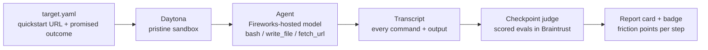

# agent-ready

**Can a clean agent finish your quickstart?**

[](https://zhannur.github.io/agent-ready/)
[](https://zhannur.github.io/agent-ready/)
[](https://zhannur.github.io/agent-ready/)
[](https://zhannur.github.io/agent-ready/)

Every SDK team believes their quickstart works. `agent-ready` checks: it boots a pristine
sandbox with nothing installed, drops an autonomous agent in it with only your public
quickstart URL, and lets it try to reach the quickstart's promised outcome — exactly the
way a first-time developer (or, increasingly, their coding agent) would. Every step is
recorded, scored against acceptance checkpoints, and rendered as a graded report with a
README badge.

If an agent can't get through your docs from a clean machine, neither can a lot of your
future users.

## How it works



- **Daytona** provides the clean room: one ephemeral sandbox per run, destroyed after.
- **Fireworks AI** hosts the agent's model (and the checkpoint judge).
- **Braintrust** stores every run as a scored eval: checkpoint pass/fail with evidence,
  so scores are comparable across SDKs and across doc revisions.

## Checkpoints

| Checkpoint | Weight | Meaning |
|---|---|---|
| env_ready | 10 | Toolchain the quickstart needs was ready |
| installed | 20 | Vendor SDK/CLI installed successfully |
| configured | 15 | Credentials wired the way the docs instruct |
| first_call | 25 | First API call / core action succeeded |
| verified | 30 | The promised output demonstrably produced |

The weighted total is the **Agent-Ready score** (0–100), served as a shields.io badge:

``

## Run it

```bash
uv sync
cp .env.example .env   # fill in keys
uv run python -m lab.cli run targets/fireworks.yaml
uv run python -m lab.cli site   # builds docs/index.html (served via GitHub Pages)
```

A run only uses **public docs + credentials a new signup would have**. No fabricated
success: a checkpoint passes only when real command output proves it.

---
Built solo at **Daytona HackSprint w/ Braintrust — SF, July 2026**.
